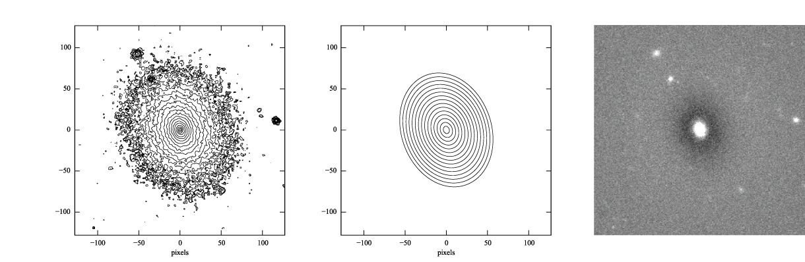
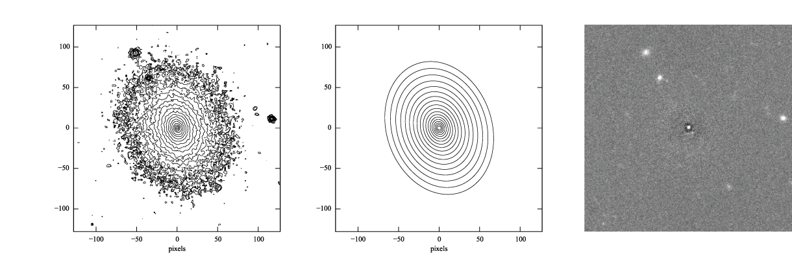
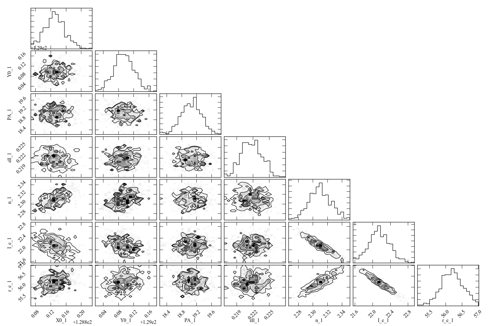
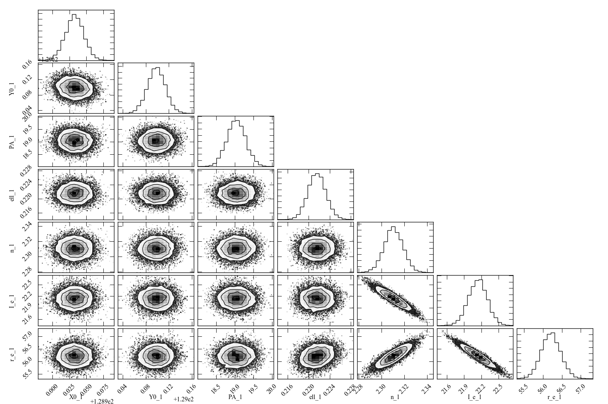

# Getting Started with Imfit: Tutorial

### Contents:

1.  [Preliminaries](#prelim)
2. [Fitting Your First Image](#fittingfirst)
3. [Inspecting the Fit: Model Images and Residuals](#inspecting)
4. [Better Fits: Telling Imfit the Truth About the Image](#betterfits-truth)
5. [Better Fits: Masking](#betterfits-masking)
6. [Better Fits: Trying Different Models](#betterfits-models)
7. [More Correct Fits: PSF Convolution](#psf)
8. [Chi-Squared and All That: Using Different Fit Statistics](#fitstats)
9. [Parameter Uncertainties and Correlations: Bootstrap and MCMC](#uncertainties)

---

## Preliminaries

To get started with Imfit, you need to download the pre-compiled binary
distribution for your platform (Mac or Linux), or else download and
compile the source code; links to both can be found on [the main imfit
page](http://www.mpe.mpg.de/~erwin/code/imfit/). Notes on how to compile
the source code can be found in the Imfit
[documentation](https://www.mpe.mpg.de/~erwin/resources/imfit/imfit_howto.pdf).

In both the binary-only and source-code distributions, there is a subdirectory
called "examples", which has some images we'll be using in this tutorial --
ic3478rss\_256.fits, ic3478rss\_256\_mask.fits, and psf\_moffat_51.fits -- as
well as some configuration files (names starting with "config\_"). You can
go ahead and work in the examples subdirectory, or copy the files there to
another directory and work there.

If you want to download just the examples directory and its files, you
can find it [here](https://www.mpe.mpg.de/~erwin/resources/imfit/imfit_examples.tar.gz).

 

## Fitting Your First Image

Imfit requires, as a minimum, two things:

1. An image in FITS format containing the data to be fit;
2. A configuration file describing the model you want to fit to the data.

So to start off, we'll try fitting the image file ic3478rss\_256.fits
(a 256 x 256-pixel cutout from a DR7 SDSS *r*-band image of the
dwarf elliptical galaxy IC 3478) with a simple exponential model, which is
described in the configuration file config\_exponential\_ic3478\_256.dat. To
do the fit, just type (all on one line):

	imfit ic3478rss_256.fits -c config_exponential_ic3478_256.dat 
	  --sky=130.14

The `--sky=130.14` is a note to Imfit that the image had a
background sky level of 130.14 counts/pixel which was previously subtracted; if we
don't include this, Imfit will get confused by the fact that some of the
pixels in the image have slightly negative values. (Note that you can
use `=` or a space to connect an option with its argument on the command
line.)

(Note that, as is normal for Unix-style commands, all invocations of
`imfit` should be entered as a single line, even though in this and some
of the other examples it's displayed on two or more lines to fit the web page
better.)

Imfit will print some preliminary information, confirming which files
are being used, the size of the image being fit, the image functions
used in the model, and so forth. It will then call the minimization
routine, which prints a minimal set of updates for each iteration. At
the end, a summary of the fit is printed (final &chi;2, etc.), along with
the best-fitting parameters of the model and some crude estimates of the
uncertainties for each parameter. These parameters are also
saved in a text file: "bestfit\_parameters\_imfit.dat", which includes a
record of how imfit was called and a short summary of the fit. (You can
specify a different name for this output file via the `--save-params`
option.)

	Reduced Chi^2 = 0.450366
	AIC = 29524.514967, BIC = 29579.055814

	X0		128.8530 # +/- 0.0517
	Y0		129.1035 # +/- 0.0633
	FUNCTION Exponential
	PA		19.7364 # +/- 0.467417
	ell		0.231428 # +/- 0.00333939
	I_0		315.173 # +/- 1.33252
	h		20.5726 # +/- 0.0748152

Congratulations; you've fit your first image!

 

## Inspecting the Fit: Model Images and Residuals

So what kind of fit did we get, and how good was it? When you run imfit, you can tell it
to save the best-fitting model image, and the residual image (data - model) as well,
using the `--save-model` and `--save-residual` commandline options:

	imfit ic3478rss_256.fits -c config_exponential_ic3478_256.dat 
	  --sky=130.14 --save-model=model.fits --save-residual=resid.fits

These are FITS files with the same dimensions as the data image.

If you look at the residual image (below, right), you can see it's systematically bright in the
center, with an oval region of negative pixels outside. This is a pretty good indication
that the exponential model isn't actually a good match to the data, something we'll
try to address in a bit.

<!-- RapidWeaver path

-->

<!-- RapidWeaver path

-->

**Figure 1:**  log-scaled isophotes for original SDSS image (left) 
and  best-fitting exponential model (middle), along with linear-scaled residual image 
(data - model, right).

### Generating model images with makeimage

You can also generate a copy of the model image using the "makeimage" program
which comes with imfit; it can take a best-fit parameter file produced by imfit
as its own input. To run makeimage, you need:

1. An input configuration file;
2. Some specification for the size of the output image (this can be included in
the configuration file, if you wish).

To run makeimage, you can type

	makeimage bestfit_parameters_imfit.dat --refimage=ic3478rss_256.fits

This tells makeimage to make an image with the same dimensions as the
"reference image" (ic3478rss\_256.fits, in this case). You can also use
the commandline parameters `--ncols` and `--nrows` to directly specify
the output image size, or you can edit the input configuration file so
it specifies the image size there (see the main documentation). By
default, this saves the model image using the filename "model.fits"; you
can use the `-o` commandline parameter to specify your own name for the
outer file.

 

## Better Fits: Telling Imfit the Truth About the Image

Leaving aside the question of mismatches between an exponential model
and the actual galaxy, this isn't the best possible fit yet for our
model.  (You may have noticed that imfit reported a reduced &chi;2 value
of ~ 0.45, which is a sign something odd is going on.) For one thing, we've
deceived imfit about the nature of the data. The default &chi;2 minimization
process that imfit uses is based on the Gaussian approximation to
Poisson statistics, and assumes that the pixel values in the image are
detected photoelectrons (or N-body particles, or something else that
obeys Poisson statistics). In reality, our image deviates from this
ideal in three ways:

1. There was a sky background that was previously subtracted from the image;
2. The pixel values are counts (ADUs), not detected photoelectrons;
3. The image has some Gaussian read noise.

To fix this, we can tell imfit three things:

1. The original background level (which we're already doing, via the `--sky` option);
2. The A/D gain in electrons/count, via the `--gain` option;
3. The read noise value (in electrons), via the `--readnoise` option

In the case of this SDSS image, the corresponding tsField FITS table (from the SDSS
DR7 archive) has information about the A/D gain and the read noise (or "dark variance")
and tells us that the gain and read noise are 4.725 and 4.3 electrons, respectively,
for the *r*-band image.

So we can re-run the fit with the following command:

	imfit ic3478rss_256.fits -c config_exponential_ic3478_256.dat 
	  --sky=130.14 --gain=4.725 --readnoise=4.3

Now the reduced &chi;2 is about 2.1, which isn't necessarily that good, but is at
least statistically plausible!

	Reduced Chi^2 = 2.082564
	AIC = 136482.400611, BIC = 136536.941458

	X0		128.8540 # +/- 0.0239
	Y0		129.1028 # +/- 0.0293
	FUNCTION Exponential
	PA		19.7266 # +/- 0.217212
	ell		0.23152 # +/- 0.00155236
	I_0		316.313 # +/- 0.619616
	h		 20.522 # +/- 0.0346742

 

## Better Fits: Masking

If you look at the image (e.g., with SAOimage DS9 or another FITS-displaying
program), you can see features that most likely aren't part of the galaxy
-- for example, there are certainly three (and possibly five) distinct,
small objects near the galaxy which are probably foreground stars or
background galaxies. Since they're relatively bright compared to the
outer parts of the galaxy, they will bias the fit.

To prevent this from happening, you can mask out parts of an image. This is
done with a separate mask image: an image of the same size as the data, but with
pixel values = 0 for all the "good" pixels and >= 1 for all the "bad" pixels
(i.e., those pixels you want Imfit to ignore).

The file ic3478rss\_256\_mask.fits in the examples directory is a mask image. You can
use it in the fit with the "`--mask`" option:

	imfit ic3478rss_256.fits -c config_exponential_ic3478_256.dat 
	  --mask ic3478rss_256_mask.fits --sky=130.14 --gain=4.725 
	  --readnoise=4.3

(Again, note that options can be linked to their targets with "=" or with just a space,
whichever make more sense to you.)

The reduced &chi;2 is slightly smaller; in addition, the position angle, ellipticity, and 
scale length of the best-fitting model have changed slightly (the smaller scale length
is because imfit is no longer trying to account for the excess light from the other sources
by radially stretching the exponential).

	Reduced Chi^2 = 1.964467
	AIC = 124602.443320, BIC = 124656.787960

	X0		128.8793 # +/- 0.0237
	Y0		129.0589 # +/- 0.0289
	FUNCTION Exponential
	PA		18.7492 # +/- 0.23086
	ell		0.220646 # +/- 0.00159077
	I_0		321.631 # +/- 0.634224
	h		20.0684 # +/- 0.034584

 

## Better Fits: Trying Different Models

As noted above, it looks like the exponential model is not a good match to the galaxy.
You can see the available model components ("image functions") by calling imfit with the 
`--list-functions` option:

	imfit --list-functions

You can also see the full set of parameters for each image function using the `--list-parameters`
option:

	imfit --list-parameters

A model fit to an image can consist of multiple image functions (and multiple
instances of each image function), but for now let's just try a S&eacute;rsic function with
elliptical isophotes. This is encoded in the "config\_sersic\_ic3478\_256.dat" file.

	imfit ic3478rss_256.fits -c config_sersic_ic3478_256.dat 
	  --mask ic3478rss_256_mask.fits --gain=4.725 --readnoise=4.3 
	  --sky=130.14

The result is a significantly better fit:

	Reduced Chi^2 = 1.055366
	AIC = 66946.393806, BIC = 67009.795665

	X0		128.9321 # +/- 0.0130
	Y0		129.0983 # +/- 0.0155
	FUNCTION Sersic
	PA		19.0449 # +/- 0.247618
	ell		0.221656 # +/- 0.00171861
	n		 2.3108 # +/- 0.00818546
	I_e		22.1351 # +/- 0.163568
	r_e		56.2217 # +/- 0.256568

<!-- 

 -->

<!-- local, non-RapidWeaver path 

-->

**Figure 2:** log-scaled isophotes for original
SDSS image (left) and best-fitting S&eacute;rsic model (middle), along with
linear-scaled residual image (data - model, right). Note that the
residuals are much improved over the residuals for the exponential model
([Figure 1](#fig1)).

This is clearly a *much* better fit!
 

 

## More Correct Fits: PSF Convolution

Astronomical images obtained with telescopes are almost always affected
by telescope optics, atmospheric seeing, and so forth, so that the
actual recorded image -- what we're trying to model -- is really the
convolution of an idealized "true" image with a point-spread function (PSF).

You can simulate this process in Imfit by providing a PSF image in
FITS format, using the ``--psf`` option. This can be any square, centered
image, based on observed stellar PSFs, produced by telescope
modeling software, etc. Imfit will then convolve the
internally generated model image with the PSF image before comparing the
model with the data.

Here, we use a pre-generated 51 x 51-pixel PSF image which approximates the seeing in the
SDSS image using a circular Moffat function:

	imfit ic3478rss_256.fits -c config_sersic_ic3478_256.dat 
	  --mask ic3478rss_256_mask.fits --gain=4.725 --readnoise=4.3 
	  --sky=130.14 --psf psf_moffat_51.fits
	
	Reduced Chi^2 = 1.074154
	AIC = 68137.906037, BIC = 68201.307896

	X0		128.9174 # +/- 0.0147
	Y0		129.0800 # +/- 0.0176
	FUNCTION Sersic
	PA		19.0576 # +/- 0.247209
	ell		0.227617 # +/- 0.00175711
	n		2.48051 # +/- 0.00983808
	I_e		19.9097 # +/- 0.169477
	r_e		59.5241 # +/- 0.309487

<!-- local, non-RapidWeaver path 

-->

**Figure 3:** log-scaled isophotes for original
SDSS image (left) and best-fitting, PSF-convolved S&eacute;rsic model (middle), along with
linear-scaled residual image (data - model, right).

The residuals for the PSF-convolved fit (above right) are systematically somewhat
*worse* than without the PSF (compare with [Figure 2](#fig2)): there is a small
central excess and a surrounding negative-pixel "moat". So the galaxy is probably
a bit more complicated than just a single S&eacute;rsic function can accomodate. (In fact,
[Janz et al. 2014](http://adsabs.harvard.edu/abs/2014ApJ...786..105J), working with 
a higher-resolution and higher-S/N *H*-band image, found
that a S&eacute;rsic + exponential model is a better fit for this galaxy
than just a S&eacute;rsic function by itself.)

 

### Makeimage and PSF images

Makeimage can be used with PSF images to generate properly convolved model images,
using the same `--psf` option that imfit uses. E.g.

	makeimage bestfit_parameters_imfit.dat --refimage=ic3478rss_256.fits 
	  --psf=psf_moffat_51.fits

Makeimage can also be used to *generate* PSF images; in fact, the PSF
image we used above was generated using the
"config\_makeimage\_moffat_psf.dat" configuration file, which is
included in the examples subdirectory (note that this file includes
directives specifying the size of the output image, so the `--refimage`
option isn't necessary in this case). A model PSF image
can be constructed using any combination of the image functions that imfit
and makeimage know about -- Gaussian, Moffat, the *sum* of Gaussians and
Moffats, etc.

 

## Chi-Squared and All That: Using Different Fit Statistics

Fitting a model to an image involves some assumptions about the underlying *statistical*
model that generated your data -- i.e., what kind of statistical distributions the individual
pixel values are drawn from. This in turn affects how the "fit statistic" -- the
quantity you are trying to minimize in order to get the best fit -- is calculated.

By default, imfit uses a "data-based" &chi;2 approach, which assumes that
individual pixel values are drawn from the Gaussian approximation of a 
Poisson distribution. To compare a model pixel value to the data value, we
assume that the Gaussian distribution has a mean equal to the model value, with
the dispersion equal the square root of the *data* value. (If you provide
a read-noise value, this is added in quadrature to the data-based dispersion.)

One alternative is to take the dispersion from the square root of the (current)
*model* value, which you can do with the `--model-errors` flag:
 
	imfit ic3478rss_256.fits -c config_sersic_ic3478_256.dat 
	  --mask ic3478rss_256_mask.fits --gain=4.725 --readnoise=4.3 
	  --sky=130.14 --psf psf_moffat_51.fits --model-errors

    Reduced Chi^2 = 1.075389
    AIC = 68216.271136, BIC = 68279.672995

    X0		128.9250 # +/- 0.0127
    Y0		129.0750 # +/- 0.0171
    FUNCTION Sersic
    PA		19.0862 # +/- 0.247458
    ell		0.227161 # +/- 0.00175713
    n		2.59104 # +/- 0.0111591
    I_e		17.9857 # +/- 0.167361
    r_e		63.6443 # +/- 0.360108

The result is not dramatically different, though both *n* and *r\_e* are
slightly larger and *I\_e* is slightly smaller; this is expected due to
the differing biases which apply to the data-based and model-based
approaches (see [Erwin
2015](http://adsabs.harvard.edu/abs/2015ApJ...799..226E) and references
therein).

You can *also* tell imfit to use an external "noise" or "error" map --
an image whose pixel value are standard deviations, perhaps produced by
a data pipeline. In this case, you use the `--noise` option to specify the
corresponding FITS file. (If your noise/error map has units of *variance*,
you can add the `--errors-are-variances` flag to tell imfit this.)

Finally, you can abandon the &chi;2 Gaussian statistical model entirely and assume
that your data comes from a pure Poisson process (rather than the
Gaussian approximation of one). This involves a "Poisson maximum-likelihood ratio" (Poisson
MLR) approach, and is especially appropriate for data with
very low counts per pixel, where the Gaussian approximation really breaks down.
Imfit allows you to do with the `--poisson-mlr` flag (or just `--mlr` for short):

	imfit ic3478rss_256.fits -c config_sersic_ic3478_256.dat 
	  --mask ic3478rss_256_mask.fits --gain=4.725 --sky=130.14 
	  --psf psf_moffat_51.fits --mlr

    Reduced Chi^2 equivalent = 1.104470
    AIC = 70060.584150, BIC = 70123.986009

    X0		128.9218 # +/- 0.0146
    Y0		129.0796 # +/- 0.0173
    FUNCTION Sersic
    PA		19.0826 # +/- 0.244875
    ell		0.227176 # +/- 0.00173874
    n		2.55157 # +/- 0.00999606
    I_e		18.6469 # +/- 0.162048
    r_e		62.1518 # +/- 0.331032

(Note that we leave off the `--readnoise` option, because the pure-Poisson approach
cannot handle separate read-noise components. In most cases, this be done 
without affecting the fit in any significant way.)

The result is a fit which is in between the two &chi;2 alternatives, though 
closer to the model-based approach. (Again, this is consistent with what we
would expect from the different statistical models being used, with the
pure-Poisson approach being the most unbiased.)

(See [Erwin
2015](http://adsabs.harvard.edu/abs/2015ApJ...799..226E) for more on the
statistical background and the corresponding biases.)

 

## Parameter Uncertainties and Correlations: Bootstrap and MCMC

As you probably noticed, part of the output of imfit is a set of 1-sigma
parameter uncertainties for each fitted parameter in the model. These
are automatically generated when using the default (Levenberg-Marquardt)
minimizer. They're not usually all that accurate, they assume
the uncertainties are all symmetric, and they don't provide any information
about possible correlations or anti-correlations between different
parameter values.

If you would like a better picture of what the parameter uncertainties
and possible correlations are like, there are two options: one fast but
noisy, the other slow but detailed:

1. **Boootstrap resampling**: This involves generating a new version of
the data image by sampling from the original image with replacement
(ignoring masked pixels) and re-running the fit. Do this several hundred
(or ideally several thousand) times, and you get a distribution of
parameter values that can approximate the likelihood (e.g., the
&chi;2).

2. **Markov chain Monte Carlo (MCMC) analysis**: This involves computing
Markov chains consisting of sequences of sets of parameter values. After
an initial "burn-in" period, the distribution of points in parameter
space represented by a chain should converge to something proportional to the
likelihood. (The particular algorithm used by Imfit actually runs multiple
chains in parallel.)

### Bootstrap Resampling Example

To save time, we'll use the model *without* PSF convolution (you can of course
use PSF convolution with bootstrap resampling; it will just take longer):

	imfit ic3478rss_256.fits -c config_sersic_ic3478_256.dat 
	  --mask ic3478rss_256_mask.fits --gain=4.725 --readnoise=4.3 
	  --sky=130.14 --bootstrap 500 --save-bootstrap=bootstrap_output.dat

This will do the fit as before, print the result, and then start doing
500 rounds of bootstrap resampling and fits to the resampled data. When
it's done (this takes about 30 seconds on a 2012 MacBook Pro with a quad-core
CPU) it will print out a summary of the best-fit parameter values
and their uncertainties; it will also save all 500 sets of parameter
values in the file bootstrap\_output.dat.

This file has one column per parameter; the column names are the parameters with
numbers appended (e.g., `X0_1`, `n_1`) to make it possible to distinguish different
parameters when multiple versions of the same function, or just multiple functions
that have the same parameter names, are used in the model. (I.e.,
all parameters for the first function will have `_1` appended, all parameters
from the second will have `_2` appended, etc.)

In the `python/` subdirectory of the main Imfit package there are a couple of
Python modules: imfit\_funcs.py and imfit.py. The latter has a simple function
to read in the bootstrap-resampling output file (`imfit.GetBootstrapOutput`), which
will return a list of parameter names and a 2D Numpy array with the full set of
parameter values.

There are many possible ways of analyzing the bootstrap-resampling
output. One thing you can do, if the model is not *too* complicated, is
make a scatterplot matrix (a.k.a. corner plot) of the parameters. The
Python package [corner.py](https://corner.readthedocs.io/en/latest/) can be used for this;
here's a quick-and-dirty example that also uses the `imfit.GetBootstrapOutput`
function:

	>>> import imfit, corner
	
	>>> columnNames, bootstrapResults = 
	    imfit.GetBootstrapOutput("bootstrap_output.dat")
	>>> corner.corner(bootstrapResults, labels=columnNames)

The result is shown below.

<!-- local, non-RapidWeaver path

-->

**Figure 4:** Scatterplot matrix of parameter values from 500 rounds of bootstrap resampling
fits to the IC 3478 *r*-band image (S&eacute;rsic model, no PSF convolution).
Note the clear correlations between the S&eacute;rsic model parameters (n, r\_e,
I\_e).

### MCMC Example

MCMC analysis uses a separate program called `imfit-mcmc`. You can run it
with the following command (note that it's identical to the regular `imfit`
command, except for the option that specifies the root name for output files):

	imfit-mcmc ic3478rss_256.fits -c config_sersic_ic3478_256.dat 
	  --mask ic3478rss_256_mask.fits --gain=4.725 --readnoise=4.3 
	  --sky=130.14 --output=mcmc_ic3478r

**Warning:** this will take several minutes! (On my 2012 MacBook Pro with a quad-core
Intel i7 CPU, it takes about eight or ten minutes.)

Various updates will be printed as the program runs. Once a trial "burn-in" phase
is over, `imfit-mcmc` will test for possible convergence of the chains every 5,000
generations by looking at the last half of each chain. If convergence is detected,
the program will quit; otherwise, it will quit when it reaches 100,000 generations. (These
values can be changed with command-line options.)

When it's done, you will have *seven* output text files, named
mcmc\_ic3478r.1.txt, mcmc\_ic3478r.2.txt, etc., one for each of the
individual chains. (By default, the total number of chains is equal to the number
of free parameters in the model.) Each is similar to the bootstrap-resampling output
file in format, with one column for each parameter in the model (plus
some extra bookkeeping columns that you can ignore unless you're
interested in details of the MCMC process), and one row for each
generation in the chain; each chain will have several tens of
thousands of generations. 

The ideal thing to do is probably to take the last half of each chain and combine
them all into one gigantic set of parameter values. There's a Python
function for that in python/imfit.py, which returns the same kinds of output
as imfit.GetBootstrap (i.e., a list of parameter names and a 2D Numpy array).
Here's an example of using that, and then making a scatterplot matrix with
the corner.py module, just as we did for the bootstrap output:

	>>> import imfit, corner
	
	>>> columnNames, allchains = imfit.MergeChains("mcmc_ic3478r", 
	    secondHalf=True)
	>>> corner.corner(allchains, labels=columnNames)

The result is shown below.

<!-- local, non-RapidWeaver path 

-->

**Figure 5:** Scatterplot matrix of parameter values from Markov
chain Monte Carlo analysis of the IC 3478 *r*-band image (S&eacute;rsic
model, no PSF convolution). Note the strong correlations between the
S&eacute;rsic model parameters (n, r\_e, I\_e), and the weaker correlation
between r\_e and ellipticity and between X0 and Y0. Since this plot is based on about 300,000
samples, it is considerably less noisy than the version based on 500
rounds of bootstrap resampling in [Figure 4](#fig4).

<!--
# Bits of Advice

-->
