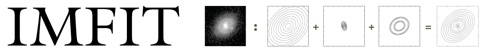

.. Imfit documentation master file, created by
   sphinx-quickstart on Tue May  8 10:54:38 2018.
   You can adapt this file completely to your liking, but it should at least
   contain the root `toctree` directive.

=================================

`Imfit <https://www.mpe.mpg.de/~erwin/code/imfit/>`_ is an open-source
C++ program for fitting models to astronomical images (primarily of
galaxies). It is fast, flexible, and designed to be easily extended with
new functions for components of the model image.

**Examples of Use:**

Fitting an image (with a model specified in the configuration file ``model_description.txt``):

    ``$ imfit someimage.fits --config model_description.txt``

Fitting a subsection of the image and convolving the model with a Point-Spread-Function image,
using Differential Evolution as the solver:

    ``$ imfit someimage.fits[500:750,600:800] --config model_description.txt --psf psf.fits --de``

Markov Chain Monte Carlo (MCMC) analysis of the same image and model:

    ``$ imfit-mcmc someimage.fits[500:750,600:800] --config model_description.txt --psf psf.fits``

Useful things:

* ``imfit -h`` -- lists command-line flags and options
   
* ``imfit --list-functions`` -- lists all available image functions for models
   
* ``imfit --list-parameters`` -- lists the individual parameters for all image functions
   
* ``imfit --sample-config`` -- writes a sample configuration file to the current directory

The main documentation for Imfit is in the PDF file 
`imfit_howto.pdf <https://www.mpe.mpg.de/~erwin/resources/imfit/imfit_howto.pdf>`_.

**Where to Get It:**

Pre-compiled binaries for Linux and macOS, along with the source code
for compilation, are available 
`here <https://www.mpe.mpg.de/~erwin/code/imfit/>`_.

The full source-code distribution is available at 
`Imfit's Github page <https://github.com/perwin/imfit/>`_.

.. toctree::
   :maxdepth: 2
   :caption: USER DOCUMENTATION:

   imfit_tutorial
   config_file_format
   fitting_images
   writing_new_image_functions
   frequently_asked_questions

.. toctree::
   :maxdepth: 2
   :caption: API DOCUMENTATION:

   api_ref/api_index

Indices and tables
==================

* :ref:`genindex`
* :ref:`modindex`
* :ref:`search`
